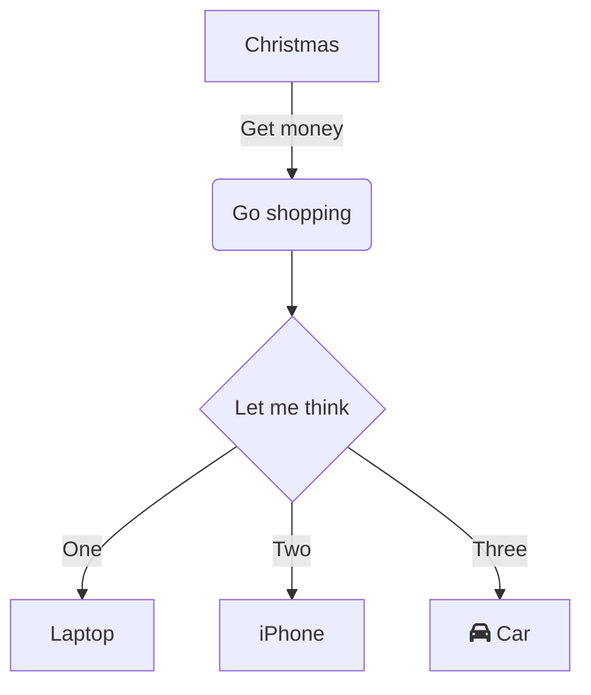

# Ansel Documentation

This is the user documentation for [Ansel](https://ansel.photos). The content is authored in markdown and rendered to HTML using [Hugo](https://gohugo.io).

This repository tracks the current Ansel development version and can be found at [ansel.photos](https://ansel.photos/en/doc/).

## Obtaining and Building

### Cloning

```bash
git clone https://github.com/aurelienpierreeng/ansel-doc
```
### Hugo

This site is built with the static site generator Hugo v0.98.0

```bash
$ ./hugo version
```

The theme is imported from the main Ansel website. To force-update it:
```bash
$ hugo mod get -u ./...
```

### Updating

If you have the repo cloned but need to update things, it helps to make sure everything is up to date (since we are also using a submodule for the base theme).

```bash
$ git pull
$ hugo mod get -u ./...
```

### Building

You can build the HTML website locally, the production site to deploy to hosting, or the PDF.

## Local Website

Building the site to test locally can be done from the root of the repo.

```
$ hugo server -D
```

The site should then be available at http://localhost:1313/ (you can see the URL in the output of the `hugo server` command).

## Production Website

Run the `hugo` command:

```
$ hugo
```

The static files are now available to deploy to a webhost in the `public` directory. This is currently performed automatically when new changes are pushed to the master branch, via github Actions.


## Guidelines

The documentation is not a manual or a course. It should answer the questions :

- "what is the GUI doing ?"
- "how can I configure the software ?"
- "what are the bottlenecks, caveats, limitations and traps ?".

The documentation expects the reader to know **what** to do and will explain **how** to do it. Start-to-end workflows, tutorials, scientific background etc., aka the **what** and the **why** go on the [main](https://ansel.photos) website.

### Content

The content folder is located in the `content/` directory and the structure of folders and sub-folders will produce the structure of sections and sub-sections on the website. Files are written in Markdown and end with `.md` extension. Each file should have the following header (frontmatter):

```
---
title: This page title
date: 2022-12-04T02:19:02+01:00
lastmod: 2022-12-31
draft: false
weight: 120
tags: ["color science", "pipeline"]
---
```

- The title is mandatory. Please use initial capitals, like in real language.
- The date is set once for all at the creation of the page and should never change after.
- Update the `lastmod` date with today's date everytime you update a file, and add it if not present. On the internet, every content is perishable and this helps readers to guess wether the page is still relevant at the time of reading or not.
- `draft` set to `true` means the page will be on the repository (in the source code) but will not appear on the website front-end. Set to `false`, the page is visible on front-end.
- `tags` are optional but welcome. The content is, by default, organized vertically (hierarchically). Tags help to create horizontal (thematic) links between pages. Relevant tags could be "film processing", "HDR", "monochrome", etc. Reuse existing tags in priority. Tags should always be a list, even when there is only one (otherwise Hugo build breaks).


### Internal links

Internal links should use relative paths from the current file. The upstream darktable-doc is a huge mess in that regard: trying to follow internal links locally in an IDE leads to non-existing files most of the time (typically, they have one `../` too many). For some reason, Hugo is still able to resolve them. Ideally, links should work both in source Markdown (Ctrl + Click on the path, in most IDEs) as in the compiled HTML.

Example of internal link:

```markdown
[Filmic](../../module-reference/processing-modules/filmic-rgb.md)
```

The compiled HTML is [checked for broken links](https://github.com/aurelienpierreeng/ansel-doc/actions/workflows/hugo.yml) with 2 different test suites (HTMLTest, written in Golang, and HTMLProofer, written in Ruby), on new pull requests and on each commit on master. The tests are run in the documentation scope (https://github.com/aurelienpierreeng/ansel-doc/) and in the main website scope (https://github.com/aurelienpierreeng/ansel-website), where the documentation is embedded as a Hugo module under `$Lang/doc` (where `$Lang` is the 2-letters language code). Relative URLs for internal links work automatically in both setups.

### External links

Many external websites will return HTML codes different than `200` (200 = everything fine) because the CI bot checking broken links is… a bot, and some websites block bots. The affected URLs can be added to the ignored list in [.htmltest.yml](https://github.com/aurelienpierreeng/ansel-website/blob/master/themes/ansel/static/.htmltest.yml) to prevent false-negative. Anything returning a `404` code (page not found error) should be fixed.

### Titles (headings)

H1 titles (encoded `# Title` in Markdown) are reserved for page titles and each page should have exactly one H1. darktable-doc messed up big time here by using H1 as section titles, this is both a SEO and an accessibility mistake. The web is semantic because it's designed for crawlers and screen readers just as much as for humans.

Be aware that Hugo automatically generates anchor links for headings, using the text of the heading. Refrain from using symbols, especially (back)slashes, which will mess-up links.

Also be aware that this heading anchors may be used in other pages
within direct links. Changing an heading text will break those links. Fortunately, the [broken links CI bot](https://github.com/aurelienpierreeng/ansel-doc/actions/workflows/hugo.yml) also checks for internal anchors, so you just have to keep mind its output.


### Screenshots


Screenshots are the basics of any front-end software documentation. The darktable-doc maintainers refuse them on the ground that they can't be translated and they will be soon be obsolete given the frequency of GUI hanges, but it's a huge pedagogic mistake. Even in the wrong language, screenshots help to see what to look for in the window. Use them. They will get obsolete and may not be translated, just as the rest of the text.

### Info, Warnings, Alerts

The Ansel theme from the main website provides shortcodes to create alerts and info boxes using Hugo templating system. Here is the code:

```html

This is where you say what users should be aware of, because what may sound like a good idea in general may be really bad in some circumstances.

```

```html

Your side note here.

```

```html

Your friendly advice here.

```

```html

This is where you remind users that they are free to do shit but there will be consequences.

```

The content of the boxes can use Markdown too.


### Before/after sliders

Again, using Hugo templating system, you can display before/after sliders where both images are overlayed. This resembles the Ansel & darktable darkroom snapshot feature and can efficiently explain the effect of modules and settings in a way that users can reproduce in the GUI. Both before and after images need to have the same size in pixels.

```html

Your slider legend goes here.

```

### Maths

The docs support MathJax configured for LaTeX syntax support. Though the goal is not to write scientific litterature, there are some algorithms made of multiplications and additions that are more easily shown as equations rather than writing blocks of texts.

Inline LaTeX should be enclosed in `$`, block equations enclosed in `$$`. If you use LaTeX, you need to notify Hugo to append the Mathjax script on the page by setting `latex: true` in the header/frontmatter of the Markdown page.

### Mermaid graphs

Ansel makes an heavy use of pipelines, and those are best described with flowcharts. Mermaid.js is now supported natively on Github and within Visual Studio Code and is great for that purpose. You can [try it visually here](https://mermaid.live/edit#pako:eNpVkE1rhDAQhv9KmFML-gc8FLra7sXSQvdU9TDVcRPWfBBHlkX97002FNqcQp73mQzvCr0dCAo4e3RSnKrWiHCem1J6NbPGuRN5_rQdiYW2hm6bODwcrZildU6Z82PKH2JIlGsdYyRYKnPZEyrv_ruhTVRNjY6t6_6S09Vu4qVRHzKM_0-kp2C9NiMWI-Y9elGi7yADTV6jGsLaaxRaYEmaWijC1dDCHqcWsoTGyV57iZ4jXtP8FiTrqcZvmuZksV-CH2lYew9f4ML282Z6KCLKYHEDMlUKQ1H695EGxda_pQbvRWbg0HxZGyIjTjPtPxIKcek) and copy-paste the code of the graphs within Markdown code blocks like this:

```markdown

```

On Github, this renders:


Icons from [Font Awesome v5](https://fontawesome.com/v5/search?o=r&m=free&s=solid) are supported by Ansel main website and documentation, using the syntax `fa:fa-YOUR-ICON-CODE` as shown in the example above. Use [Font Awesome v5 search engine](https://fontawesome.com/v5/search?o=r&m=free&s=solid) to get the `fa-` code of the icons you may use.

Mermaid graphs are rendered client-side in SVG at display size and can be translated as text. Hugo is configured to detect these graphs automatically and load the javascript library only when needed.

## Notes

The documentation has an RSS localized feed, for now :

- https://ansel.photos/en/doc/index.xml,
- https://ansel.photos/fr/doc/index.xml.

This is unusual and is meant to help users keep track of changes and evolutions, by subscribing to the RSS feed or by connecting it with bots.

The date of the documentation pages set in the RSS feed is the `lastmod` parameter, aka the time of last modification. Since RSS doesn't have a `jast modified date`, it's the best I have found for the time being.
