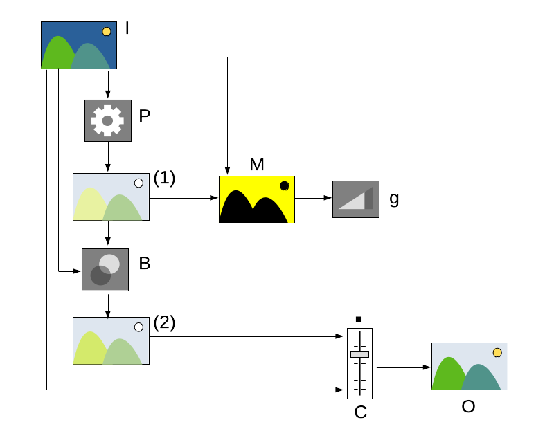

By default each module takes its input from the preceding module in the pixelpipe, performs its operation on the image data, and hands the output over to the next module in the pixelpipe. 

A module's output data can optionally be reprocessed (combined) with its input data before being handed to the next module. This additional processing step is called _blending_. Input and output data is reprocessed using algorithms called blending operators or [blend modes](./blend-modes.md).

The basic flow for blending and masking is as follows:

1. An input image _I_ is presented to a processing module _P_ in the darktable pixel pipeline.

2. The processing module performs its normal work, and produces an intermediate processed image _P(I)_.

3. The processed image is run through a blending algorithm _B(I, P(I))_, which takes the output of the _P_ module and blends it in some way with the input image, depending on the blending mode. The simplest blending mode is to simply make a copy of the intermediate processed image, ignoring the input image in the process. Other options are things like doing a multiplication for each pixel in the input and intermadiate processed image, taking an average between the input and output image, and so forth. Refer to the [blend modes](./blend-modes.md) section for description of blending operators.

4. A mask _M_ can be specified by the user in order to narrow down which parts of the image will be affected by the module processing. A [_drawn mask_](./masks/drawn.md) can be used where shapes are drawn out on top of the image to identify which areas should be processed, and which areas should be excluded from processing.

   The mask can also be defined by specifying some property of the pixels in the image (such as hue, brightness, etc.) and chhosing a range of values for that property to define which pixels should be included or excluded from the mask. This is known as a [_parametric mask_](./masks/parametric.md). Normally it is the values for the pixels in the input image _I_ that are used as the basis for this selection, but it is also possible to use the values of pixels in the intermediate processed image _P(I)_ for the purpose of this selection.

   It is even possible to combine these two methods, so that only pixels falling inside or outside a drawn shape are considered for selection by the parametric mask. This is called a [_drawn and parametric mask_](./masks/drawn-and-parametric.md).

   Once you have defined a mask, it can be made visible so you can see which parts of the final image will be processed (the parts highlightedin _yellow_), versus the parts that will remain unprocessed (the non-yellow bits).

5. There is an overall opacity slider _g_ which weakens the mask so that more of the original unprocessed image will show through in areas selected by the mask for image processing. This _opacity_ parameter, having a value between 0% and 100%. Typically an opacity of 0% outputs an image which is identical to the input image (the module has no effect) whereas an opacity of 100% delivers the maximum effect of the module and blending mode.

6. The output of the blender _B(I, P(I))_ and the original input image _I_ are added together in a final mixer _W_ as a weighted sum, where the weighting towards original image versus the processed/blended image depends on the mask level _M_ and the overall opacity paremeter _g_. This mixing operation produces the final image _O_ that will be passed on to the next module.

Blending and masking functionality is controlled via a group of icons located at the bottom of each applicable module. 

These icons enable the following masking and blending options, from left to right:

off
: Module output is passed to the next module in the pixelpipe without additional reprocessing. No further controls are displayed. 

uniformly
: Input and output images are reprocessed to the same extent for all pixels with the extent of the blending controlled by a single opacity slider. Additional controls to choose the blend mode and opacity are displayed. The default blend mode is “normal” with an opacity of 100%.

[drawn mask](./masks/drawn.md)
: Reprocessing takes place with the chosen blend mode and opacity based on pixel location as defined with a drawn mask. Additional controls are displayed which allow you to draw a mask using one or more shapes. If no mask elements are drawn then all pixels have the same opacity, as defined by the opacity slider.

[parametric mask](./masks/parametric.md)
: Reprocessing takes place with the chosen blend mode and opacity based on the properties of individual pixels. Additional controls are displayed that allow you to adjust the opacity on a per-pixel basis determined by pixel values.

[drawn & parametric mask](./masks/drawn-and-parametric.md)
: Reprocessing takes place with the chosen blend mode and opacity based on a combination of a drawn mask parametric mask.

[raster mask](./masks/raster.md)
: Reprocessing takes place with the chosen blend mode and opacity based on a mask that was generated within a different module

---

**Note:** Not all of these blend options are available for every module.

---

