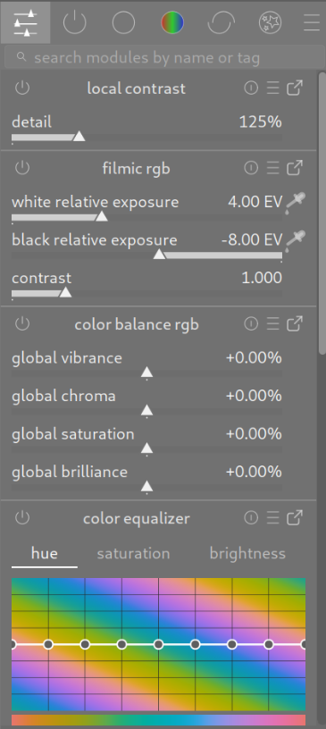

The quick access panel allows you to access widgets from a number of processing modules all in one place.

You can add new widgets by right-clicking on the icon at the top-left or by using the [manage module layouts](./manage-module-layouts.md) screen.

Click on the icon to the right of the module name to open the full version of that module. Click on the icon to the left of the module name to enable/disable the module.

Currently only some widgets may be added to this panel (check boxes, sliders, comboboxes) -- more complex widgets such as curves are not supported.

If any module has [multiple instances](../processing-modules/multiple-instances.md) enabled you will no longer be able to manage that module's widgets through the quick access panel.
