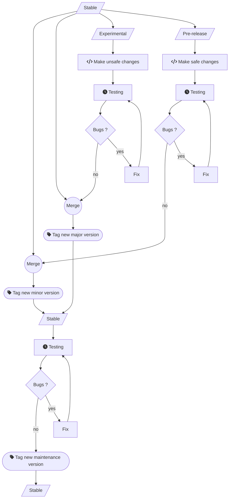

## Understanding Ansel's releases

### Ansel channels

Ansel development and release path follows 3 channels :

1. A __production channel__, which can be found on the [master branch](https://github.com/aurelienpierreeng/ansel). It contains tested code supposed to work reliably for daily use. The features being merged in this branch can be found under the _Done_ column, in the [project management Kanban board](https://github.com/orgs/aurelienpierreeng/projects/1).
2. A __pre-release channel__, backward-compatible with the production channel _(so you can switch from one to another without breaking your image edits)_, which can be found on the [candidate branch](https://github.com/aurelienpierreeng/ansel/tree/candidate). It is meant for general testing of new changes but stays relatively safe to use. The features being currently tested on this branch can be found under the _Testing_ column, in the [project management Kanban board](https://github.com/orgs/aurelienpierreeng/projects/1).
3. An __experimental channel__, __non-backward-compatible__ with either the production or pre-release channels, which can be found on the [dev branch](https://github.com/aurelienpierreeng/ansel/tree/dev). The features being currently tested on this branch can be found under the _In progress_ column, in the [project management Kanban board](https://github.com/orgs/aurelienpierreeng/projects/1).This channel needs to be used aside of the production install since it contains prototypes of new modules, new versions of old modules, and other features that will update the version of the [Ansel database](../preferences-settings/storage#database), making it incompatible with previous versions.

At all time, the  [project management Kanban board](https://github.com/orgs/aurelienpierreeng/projects/1) will show what changes are being currently worked on in the non-production channels, with links to their pull request and issue, to help traceability of changes and bug reports.

### Ansel versioning

The __production channel__ is versioned as follow :

1. All versions having the same major version number (`0.x`, `1.x`, `2.x`) produce editing histories that are compatible with each other and use the same internal [database](../preferences-settings/storage#database) version. Major version numbers are upgraded every time changes are introduced that break this property, such as new modules, database structure changes, or new versions of old modules.
2. Minor version numbers are upgraded every time new changes are made that don't break compatibility within the major version, like GUI refactorings and bug fixes.
3. The major version `0.x` is compatible with darktable 4.0 and 4.0.1 image editing histories, which means it is also compatible with edits made with any darktable version earlier than 4.0. Ansel will not maintain compatibility with upstream darktable for future versions after `0.x`, since darktable 4.2 will introduce nonsensical changes that will stay the burden of the darktable team only.
4. Versions are tested snapshots of the __production channel__. This channel will keep getting changes in-between versions, notably from the __pre-release channel__, supposed to be safe between versions.

### Ansel testing

Tests are important because I develop and use Ansel on Linux Fedora, and I have no way of knowing how it works on other OS. A [continuous integration](https://github.com/aurelienpierreeng/ansel/actions/workflows/ci.yml) bot automatically tests building and basic execution (processing a test picture through the [CLI variant](../cli/ansel-cli) of the software), on Windows 10, Linux Ubuntu 20.04 and 22.04 and Mac OS 11.7 and 12.6. On each OS, the CI bot builds using GCC 9 to GCC 12 and Clang 12 to 14.

But those continuous integration tests are not enough as they don't encompass a real desktop use with a graphical interface and will not show runtime errors. The different channels are meant to gradually push changes to production.

This graph shows how tests are dispatched in the general development workflow. Pre-built "nightly" packages are provided for all 3 channels (stable, pre-release and experimental) for all the platforms (Linux, Windows, Mac OS) and can be tested directly by anyone.

After some time without bug reports, the pre-release and experimental channels are successively merged into the stable channel, letting some time between both merges.

After some time with no bug report in the stable channel, a new maintenance release gets tagged. This means that the `x.0.0` major versions are less tested than the `x.0.1` and `x.1.0`, and should be avoided in environments where stability is the priority.

### Release schedule

The __production channel__ is updated in a rolling-release fashion. Each change triggers automatic builds on Linux, Windows and Mac OS, producing "nightly" packages that can be directly downloaded and installed on each platform. You can subscribe to these nightly builds to update Ansel in a rolling-release fashion.

Major, minor and maintenance versions are released when they are ready.

## Ugrading between major releases

Major releases are defined by the fact that the [Ansel database](../preferences-settings/storage#database) structure will be upgraded and therefore will not be usable by previous major releases. Before the ugrading process starts, Ansel automatically backs up the database in the configuration folder, appending the version number to the database filename. To restore this backup, rename it by removing the version number.
