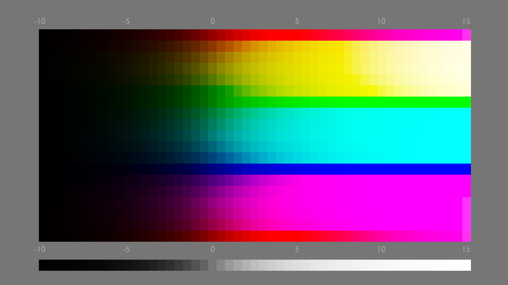
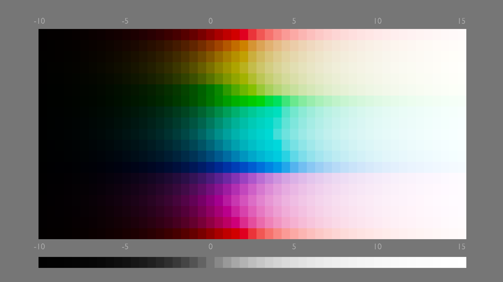

Remap the tonal range of an image using a sigmoidal function (an 'S-curve') applied to log-transformed data.

This module can be used to expand or compress the dynamic range of the scene to fit the dynamic range of the display. It is derived from another module of the same name in [Blender 3D modeller](https://www.blender.org/) by T. J. Sobotka.

---

**Note**: Modules placed before agx in the pipeline operate in [scene-referred](../../../darkroom/pixelpipe/the-pixelpipe-and-module-order.md/#scene-referred-workflow) space. Modules after agx work in [display-referred](../../../darkroom/pixelpipe/the-pixelpipe-and-module-order.md/#display-referred-workflow) space.

---

# usage

Please take note of the following guidelines while using this module within your workflow:

only use one display transform
: Never use _agx_ together with another display transform module (i.e. [_sigmoid_](./sigmoid.md), [_filmic rgb_](./filmic-rgb.md) or [_base curve_](./base-curve.md)).

adjust for the mid-tones first
: By default, the module preserves middle gray. Before using _agx_, you should first use the [_exposure_](./exposure.md) module to adjust the mid-tones to your liking.

usage guidelines
: to help you navigate the module, some practical advice is provided after a description of the controls.

# module controls

The module's controls are divided into three categories:
- tone mapping controls
- color-related controls
- post tone-mapping adjustments ('look') 

Due to the high number of controls, related controls are often grouped together in collapsible sections, and the controls are distributed between either two or three tabs.

The tabs are:
- settings
- curve (if enabled)
- primaries.

First, the contents of the various tabs are listed (note that some controls may appear at different places, depending on the choice of 2 or 3-tab mode). Then, each control will be described in detail.

# tabs

## _settings_

The _settings_ tab holds the most often-used controls:

- the _input exposure range_ section
- the collapsible curve plot (in 2-tab mode)
- the _basic curve parameters_
- the collapsible _advanced curve parameters_ section (in 2-tab mode)
- the _look_ section

## _curve_

Controls on the _curve_ tab:

- the collapsible curve plot (moved from the _settings_ tab)
- the _basic curve parameters_ (also visible on the _settings_ tab, repeated here for convenience)
- the collapsible _advanced curve parameters_ section (moved from the _settings_ tab)

The _curve_ tab is only visible in 3-tab mode, controlled via the `plugins/darkroom/agx/enable_curve_tab` variable in `darktablerc`. If the variable is set to `TRUE`, the curve plot and the advanced parameters are removed from the _settings_ tab, and can be accessed via the _curve_ tab, saving vertical space. When set to `FALSE`, all curve controls appear on the _settings_ tab. The setting is intended to be used with lower-resolution displays, to avoid the need to scroll the module.

## _primaries_

This tab holds controls similar to, but more extensive than, the [_sigmoid_](./sigmoid.md) module's _primaries_ collapsible section:

- _disable adjustments_ checkbox
- preset selector
- attenuation and rotation sliders for preprocessing before tone mapping
- attenuation and rotation reversal sliders for postprocessing after tone mapping

# controls

## The _input exposure range_

Provides controls similar to the [_filmic rgb_](./filmic-rgb.md) module, allowing you to set the black and white point. Any channel value lower than the selected _black relative exposure_ will be clipped to 0; any above the selected _white relative exposure_ will be clipped to 1. Due to implementation differences, the values will be similar to, but not identical with, the values _filmic rgb_ would pick.

Color pickers are provided to quickly pick the black or white point (_black_ and _white relative exposure_), or both (_auto tune levels_). A safety margin can be applied via the _dynamic range scaling_ slider: contrast at the ends of the dynamic range is more easily controlled via the _toe_ and _shoulder_ controls described below.

The selected exposure range will then be used as the input range of a logarithmic tone mapping operation, which then provides data that is further processed by the curve.

## The curve

The plot of curve can be displayed by opening the _show curve_ collapsible section. In 2-tab mode, this is visible on the _settings_ page; in 3-curve mode, it is available on the _curve_ page. It can be a useful tool to learn about the behavior of the curve and the effect of related controls; after some practice, unless large adjustments are made to curve parameters, you may prefer to keep it collapsed most of the time, to save space on the screen. The plot is not interactive (does not react to dragging by the mouse, for example); it simply illustrates the effect of the sliders.

The x-axis of the graph shows the selected input exposure range, measured in EV, with values relative to mid-gray; mid-gray is therefore at the 0 EV mark. The y-axis displays the linear output brightness, 18% indicating mid-gray. The scaling of the y-axis is not linear; horizontal grid lines help visualise the non-linearity. The degree of non-linearity is governed by a gamma value (default: 2.2, so the 18% mid-gray value is about halfway up the y-axis). More information on the gamma is provided in the description of the _advanced curve parameters_.

The curve has 5 important points:
- The _black and white points_ are at the left and right edges of the graph, respectively; their y values (by default, 0 and 1) can be controlled by the _target black_ and _target white_ sliders in the _advanced_ section. Adjusting those values is rarely needed, although the black point may be raised to give the image a faded look, similar to the _offset_ control in the _look_ section.
- the _pivot_ is the point around which the curve is built, and is indicated by a dot; by default, its input and output are set to mid-gray (0 EV and 18% on the x and y-axis, respectively). The contrast of the curve is set for this point. You may want to move this point to match the main subject using the provided picker.
- _toe and shoulder starting points_: it is possible to maintain a section of constant contrast above and below the pivot point. By default, in order to provide the smoothest possible transition, the toe and shoulder starting points are set to the pivot point, effectively removing this section. The steepness of the toe and shoulder section has a decisive effect on contrast in shadows and highlights, respectively, and the tool provides detailed control over this behavior, which will be discussed below (see _toe / shoulder power_ and _toe / shoulder start_).

show curve
: Expands or collapses the plot of the curve. In 2-tab mode, the plot is shown on the _settings_ page, along with other curve-related controls. In 3-tab mode, it is moved to the _curve_ tab.

### basic curve parameters

This section is always available on the _settings_ page, both 2 and 3-tab mode. In 3-tab mode, it is also available on the _curve_ tab, and changes are synchronized between the tabs.

pivot input shift
: Allows you to slide the pivot towards the left (darker tones) or right (brighter tones), without affecting its output brightness; however, using this control without changing the _pivot target output_ will affect the brightness distribution of midtones. For example, starting with the defaults, the pivot is set to map mid-gray to mid-gray; sliding it towards the left will result in an input tone that is below mid-gray to be mapped to mid-gray, effectively brightening the image.

Since normally contrast is highest around the pivot, this slider also allows you to choose at which part of the input tonal range you want to make most contrasty.

pivot target output
: Sets the output brightness belonging to tone selected by the pivot's x-coordinate. Increasing it brightens, decreasing it darkens the image.

A color picker, placed next to _pivot input shift_, is provided to pick an image area. The pivot x and y values will be adjusted so that the average value of the selected area is mapped to the current average output. This allows you to quickly select the area around which you want to center the tones of your image, without altering its brightness. You may wish to subsequently adjust the _pivot target output_ value to fine-tune the brightness of the selected area.

While you can select any value between 0 and 1, the y coordinate of the pivot is constrained by the _target black / white_ values (set to 0% and 100%, respectively).

contrast around the pivot
: Sets the contrast. This value is scaled internally, to make sure changing the exposure range does not affect apparent contrast around the pivot. This behavior is similar to that of _filmic rgb_.

**Note:** While, like with any S-shaped curve, the contrast is normally highest in the middle of the curve, around the pivot, too low values of contrast will cause the toe and/or shoulder to become 'inverted', as the curve will always make sure the selected black and white points are mapped to the selected black and white target values. In these cases, the inverted toe/shoulder will have a higher, instead of lower, contrast than the value selected here. This can be easily seen on the curve's graph. When such an inversion occurs, the respective _toe/shoulder power_ control becomes ineffective. This may sound complicated, but you will understand it immediately if you display the curve, and set a low contrast value.

toe power / shoulder power
: The word _toe_ refers to the lower bend of the curve, while the _shoulder_ is the higher bend. Normally (for an S-curve), these are the sections where the curve's contrast gradually drops as it approaches black or white, for the toe and shoulder, respectively. The _toe / shoulder power_ sliders determine how long the contrast remains mostly unchanged. Higher power values result in the contrast remaining close to the value set around the pivot for longer, followed by a more abrupt, quicker drop, and lower final contrast around the black or white point. A **high** _shoulder power_ may, for example, make white clouds brighter and keep the contrast higher in light areas, as the cost of compressing the brightest tones; a **low** _shoulder power_, on the other hand, may prevent harsh contrasts on light skin. As already noted above in the description of _contrast around the pivot_, if the initial contrast is not enough to reach the black or white point from the pivot, the corresponding section of the curve becomes inverted (the toe may become convex, pointing downwards, or the shoulder may become concave, pointing upwards), rendering the toe or shoulder power control ineffective.

### advanced curve parameters

When in 2-tab mode, these controls appear on the _settings_ page. In 3-tab mode, they only appear on the _curve_ tab.

toe start
: Defines the left-hand side point where the linear portion of the curve ends, and below which the curve starts losing slope, becoming flatter, therefore adjusting the handling of shadows. Keeping the value at 0% allows transition to start at the pivot; higher values push the transition point down towards the chosen _target black_, which is reached at 100% (provided that the curve has enough contrast). The effect is similar to the _toe power_, but allows hard clipping, leading to a loss of details in the shadows.

target black
: Lower bound that the sigmoid curve converges to as the scene value approaches the selected black point. The control can be used to create a faded analog look. Another way to achieve a similar effect is Another way to create a similar effect is the _look offset_. Alternatively, you may prefer the _global offset_ slider in the [_color balance rgb_](./color-balance-rgb.md) module.

shoulder start
: Defines the right-hand side point where the linear portion of the curve ends, and above which the curve starts losing slope, becoming flatter, therefore adjusting the handling of highlights. Keeping the value at 0% allows transition to start at the pivot; higher values push the transition point down towards the chosen _target white_, which is reached at 100% (provided that the curve has enough contrast). The effect is similar to the _shadow power_, but allows hard clipping, leading to a loss of details in the highlights.

target white
: Upper bound that the sigmoid curve converges to as the scene value approaches the selected white point. The control can be used to limit the maximum output brightness.

keep the pivot on identity line
: Automatically adjusts _curve y gamma_ to guarantee that the curve always stays S-shaped, keeping toe and shoulder controls effective. It works much like _auto adjust hardness_ in _filmic rgb_. See more below, at _curve y gamma_.

curve y gamma
: Shifts the representation of the pivot along the y-axis without changing its output brightness. This does not need to match the gamma of the display you are editing on, or the gamma of the destination (export) color space; regard it as an internal parameter of the algorithm. Also, unlike 'gamma' controls in most other software, this control has very little effect on contrast and saturation; it is similar to _hardness_ in _filmic rgb_. Contrast around the pivot is maintained; the slider controls the distribution of overall contrast in the image. Its purpose is mainly to enable you to keep the S-shape of the curve, thereby ensuring the _shoulder_ and _toe power_ controls remain effective.

## The _look_ section

These controls allow post-processing after the tone mapping operation, to fine-tune the result. Since they are applied after the tone mapping, they are _display-referred_ operations, and can result in clipping. Use them carefully. Middle gray is not preserved when using these sliders.

By default, the _look_ controls are placed inside a collapsible section. If you desire to keep them visible at all times, you can save some space by setting `plugins/darkroom/agx/look_always_visible=TRUE` in `darktablerc`.

slope
: A simple multiplication of brightness. Values above 1 brighten the image, increase contrast, and can lead to blown highlights; those below darken the image and reduce contrast. Black is not affected by this slider.

offset
: Brightens or darkens the image by shifting brightness up or down. Contrary to many implementations, only blacks are fully affected, and the effect is gradually reduced with increasing brightness; whites are not affected at all. It is important to note that the brightness range below the selected _relative black exposure_ (see _Input exposure range_ below) cannot be recovered using this control; also, valued pushed to black using the _offset_ control cannot be brightened using _slope_. Negative values crush shadows (they move the black point to the right along the x-axis); positive values can produce a faded look (they lift the black point along the y-axis).

power
: Affects brightness and contrast. Values above 1 make the image darker and compress shadows; those below 1 brighten the image, opening up shadows. The black and white points are not affected.

saturation
: Controls color intensity. Zero turns the image black-and-white. High values can lead to oversaturation. You can control image saturation in more detail via the controls on the _primaries_ tab.

preserve hue
: At a value of 0%, the colors output by the module will be based solely on the colors resulting from processing by the AgX algorithm, details of which will be provided in the section about the _primaries_ tab. By raising the slider, the original input colours can be fully or partially restored, if desired.

## The primaries

These controls are the defining feature of AgX (not just of the present module, but also the underlying Blender algorithm); they control what is called 'the path to white': how bright areas are gradually desaturated, and how their colors are shifted, as we approach pure white.

AgX processing applies the tone mapping curve on a per-channel basis. Such application of curves has a number of side effects: contrast affects not only the tonal contrast, but also saturation.
Another effect is the convergence of all non-pure primary colors (red, green, blue) to the secondaries (yellow, cyan, magenta). Since it involves the full spectrum of colors collapsing to the 3 primary and 3 secondary colors, the effect has been nicknamed 'Notorious 6'. An example can be seen below:

By desaturating the input and tweaking its colors slightly before applying the tone mapping curve, and then resaturating the result, much more pleasing results can be achieved:

The same technique also allows handling bright, highly saturated lights, for example LED stage lighting, neon signs and the like.

disable adjustments
: Turns off manipulation of primaries. It is not recommended to tick this checkbox for actual processing; it is intended as a learning tool for quick comparisons.

load primaries from preset
: Below _disable adjustments_ you can find a drop-down list and an _apply_ button. The drop-down list can be used to select a preset, and pressing _apply_ will load the primaries settings of that preset _without changing any other parameter_. That is, it's a partial application of the selected preset, concerning only the _primaries_ tab. If there are presets with identical primaries settings, only the first of those is included. The list of presets is loaded when the darkroom is opened, and also when _apply_ is pressed, even if no preset is selected (_select a preset..._ is shown in the drop-down). If you created a new preset after entering the darkroom, and wish to apply its primaries, you'll either have to leave and re-enter the darkroom, or press _apply_, then select your new preset.

base primaries
: Defines which color space is used as the basis of the AgX processing space (to what primaries the attenuation and rotation controls below are applied). Options include common spaces like sRGB and Rec2020, as well as the working space (set in the [_input color profile_](./input-color-profile.md) module), as well as the export profile (set in the [_output color profile_](./output-color-profile.md) module). For especially problematic colors, you may find that wider spaces provide better control.

### before tone mapping

The controls in this group affect the operations performed before tone mapping occurs. Consider them mostly technical. They are identical in function to the corresponding controls in _sigmoid_.

red/green/blue attenuation
: These controls define how much the corresponding component of the input color before processing. They are your primary tools to fix highly monochromatic, saturated input colors, such as stage lighting.

red/green/blue rotation
: This group of sliders determine to which secondary colors bright pixels converge. This can be used to simulate some features of human vision, where colors may be perceived as different hues depending on brightness.

### after tone mapping

The controls in this group affect the post-processing done after tone mapping. Use them as artistic controls to help you achieve the desired final look.

master purity boost, master rotation reversal
: These affect the individual red/green/blue controls below. For example, you may use the red/green/blue purity boost controls to control relative purity boost, and reduce or increase it using the master control. They are simply multipliers applied to the individual controls, for example a _master purity boost_ of 90%, combined with a _red purity boost_ of 20% results in a purity boost of 18%, or a _master rotation reversal_ of 120%, combined with a 5-degree _red reverse rotation_ results in a 6-degree rotation. Moving those sliders quickly between 0% and 100% is an easy way to observe the effect of the corresponding group of individual controls.

red/green/blue purity boost
: Use them to selectively control re-saturating the corresponding color.

red/green/blue reverse rotation
: Adjust the final hue for each primary color.

### A bit of background

If you are interested in the reasons behind manipulating the primaries to create a custom color space, read on. Otherwise, skip this section: it is not necessary in order to use the module.

With a per-channel curve, input component values that are below the pivot are attenuated by the curve; those above the pivot will be accentuated. Saturated colors have at least one component that is close to 0 (recall that if R, G and B are similar in value, the color is closer to gray, whereas fully saturated display-referred primary and secondary colors only have components with 0 and 1 values, like (1, 0, 0) for red, or (0, 1, 1) for cyan). The tone mapping curve will push those 'close to 0' input components even closer to 0, and high values towards 1, leading to either pure primary or pure secondary colors. And, since at least one component will end up near 0, no matter how bright the input is, it will never be mapped to white: not only is its hue determined by the Notorious 6 effect, its brightness is also limited to the brightness of the primary or secondary color it ends up mapped to. Its saturation will also never drop, due to the close-to-0 component.

AgX applies a trick to get around this: it uses a custom color space to apply the curves. This space has 'inset' and 'rotated' primaries; the first of those means desaturated colours, the second a skew (shifting slightly shifting reds towards blue or green, and a similar shift for the other two primary colors). Desaturation helps, because less saturated colors are less affected by the Notorious 6 (the lowest component of the color is increased, while the high-valued components are reduced). Rotation of the primaries changes to what secondary colors the tone-mapped colors converge.

# guidelines

TBC: community, share your wisdom here :-)

## Recommended workflow

- set overall exposure for the midtones using the _exposure_ module
- start with the preset _blender-like|base_ (the default)
- use the _auto tune levels_ picker to set the desired exposure range
- if desired, set the pivot on the subject using the picker next to _pivot input shift_; this makes sure contrast is maximised around the selected area
- if you wish, move the _pivot target output_ slider to make the pivot brighter or darker
- set the contrast using _contrast around the pivot_
- if needed, adjust _toe_ and _shoulder power_ to set contrast in shadows and highlights, respectively
- finally, if desired, add 'drama' by adjusting _look | power_, set overall saturation using _look | saturation_, and adjust colours using _look | preserve hue_.

## Tone mapping curve

## Primaries

## Look
