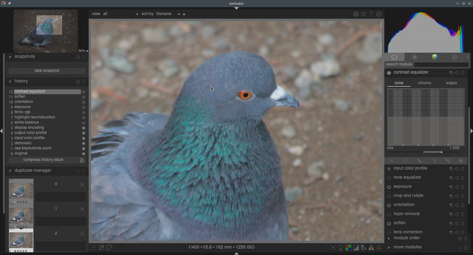
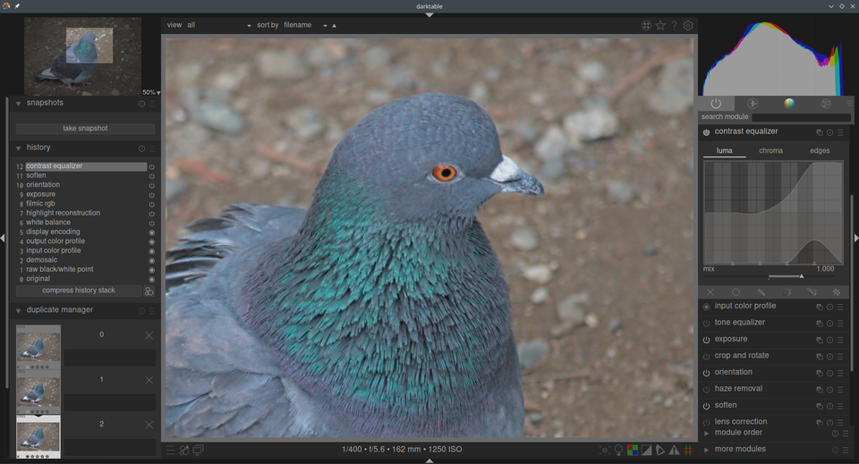
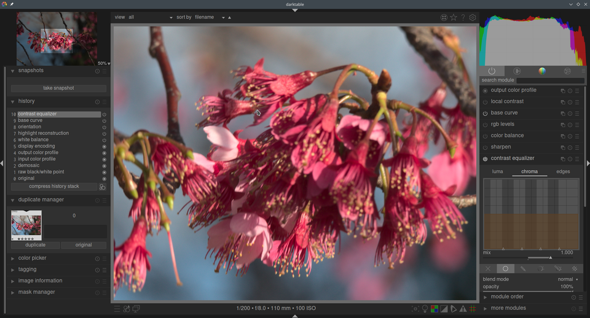
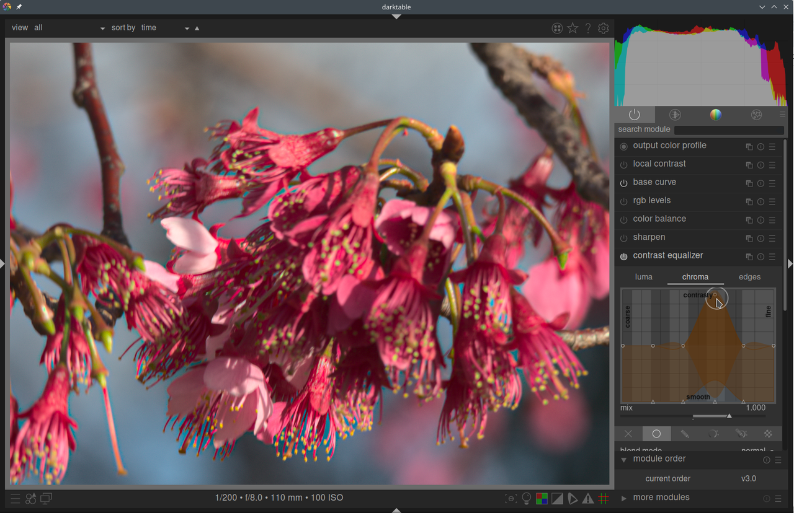
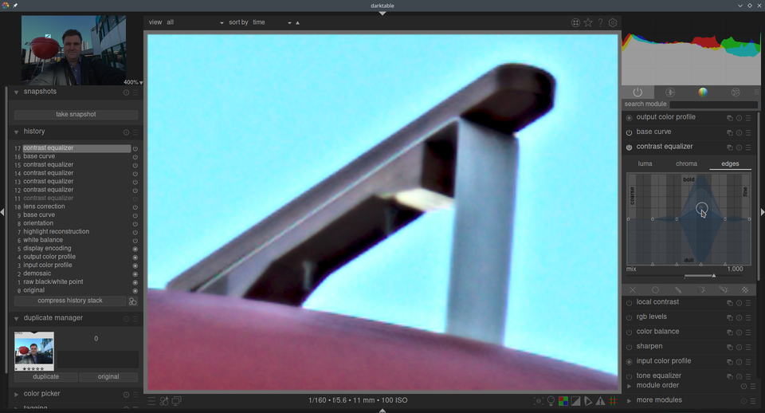

This versatile module can be used to achieve a variety of effects, such as: bloom, denoising, clarity, and local contrast enhancement. It works in the [wavelet](../../darkroom/interacting-with-modules/wavelets.md) domain and parameters can be tuned for each scale of detail separately. It works in CIE LCh color space, so that you can treat luminosity and chromaticity separately.

---

**Tip:** if you are having trouble visualising which parts of the curve will affect which details in the image, you can set the blending mode for the module to "difference". This will make the image go black excet for areas where the output of the module differs from the input. By pushing up the curve at one point, you will be able to see which details in the image are being impacted by that particular control point.

---

# module controls

Each scale of detail can be tweaked independently. In particular, you can adjust contrast boost and denoise threshold splines for both lightness ("luma') and chromaticity (“chroma”, or color saturation), as well as tune the edge-awareness parameters (“edges”) of the wavelet transform on each detail scale. The luma, chroma and edge-awareness splines are available on separate tabs, and some examples of their use are given in the following sections.

Below the spline graphs on each tab, there is a _mix_ slider. This can be used to adjust how strong or weak you want the effect of the module to be. It is a not a separate setting stored within the module within it's own right; it merely provides a convenient way to shift the control points in a coordinated way. If you leave and reenter the module, the effect of the _mix_ setting will have been integrated into the control point positions, and the _mix_ slider will once again be at the `1.00` position.

---

**Note:** when looking at the splines, if the preview is zoomed in to a scale less than 100%, you may not see any effect in the preview image when you adjust sliders at the fine detail end of the curve. In the background of the curve there are alternating light and dark stripes -- adjusting the curve where the background is stripy will result in visible changes to the preview, and making changes to the right of that where there are no more dark stripe will affect detail in the image that is not visible at that particular zoom level.

---

## luma tab

The luma tab allows you to adjust the local contrast in the luminance or brightness in the image, using the white spline that starts off running across the centre of the graph. If we raise or lower the white spline at the left end of the graph, we will increase or decrease the local contrast of coarse detail in the image. If we move the spline towards the right side of the graph, we will adjust the local contrast of the fine details in the image. When you please the mouse pointer over the graph, a white circle that indicates the radius of influence of the mouse pointer, and this circle can be made larger or smaller with the mouse wheel. When you adjust a control point, the larger the circle, the more the control points either will be affected by the adjustment. You will see in the background a highlighted region which shows what the spline would look like if you pushed the currect control point all the way to the top or bottom on the graph. More information on adjusting this style of spline is given in the [wavelets](../../darkroom/interacting-with-modules/wavelets.md) section.

Let's take the following image as an example:

Say we want to make the fine details on the bird a bit sharper, but we don't want to boost the contrast of the coarser rocks in the background and have them become a distration. By pushing up the two control points at the right hand end of the graph, we make the fine details in the eye and feathers of the bird much sharper, but the contrast in the rocks in the background is largely unaffected.

When we increase the local contrast, it can also amplify the luma noise in the image. There is a second spline used for denoising at different scales, which adjusts the wavelet shrinkage threshold. It can be pushed up from the bottom of the graph to reduce noise at that wavelet scale. Click just above one of the triangles anlong the bottom to drag up the denoising spline. You can see on the example above where the dark denoising spline has been pushed up at the fine detail end of the graph.

## chroma tab

The chroma tab allows the color contrast or saturation to be adjusted at the different wavelet scales. In the example below, we have some pink flowers:

Let's say we wanted to bring out the green color of the anthers at the end of the stamen in the flowers. The pink petals of the flowers are already quite saturated, but using contrast equalizer we can selectively boost the saturation on the small scale if the anthers without impacting the saturation of the petals. By pushing up the third control point fro mthe right, we can target the saturation of the anthers:

Just like on the luma tab, the chroma tab also has a denoising spline at the bottom of the graph. This can be used to deal with chroma noise at different scales within the image.

## edge tab

The basic wavelet _à trous_ transform has been enhanced in contrast equalizer to have an awareness of edges, which can help reduce gradient reversals and halo artifacts that can arise from the basic algorithm. The _edge_ tab does not directly act on edges in an image; rather it adjusts the level of the edge awareness feature of the wavelet transform. If you have not adjusted the luma or chroma splines, then adjusting the edge awareness spline will have no effect.

To see the sorts of artifacts that the edge awareness tries to combat, here is an example image where the edge awareness spline has been reduced to minimum, effectively disabling the edge awareness feature:

You can see the halos around the top of the wooden handle, and the darkening of the coloring of the wood, which arises from the strong boost in local contrast. This can be tamed a little by moving the edge awareness slider to somewhere around the middle:

The wavelet transform is then able to handle the transition much better without such strong gradient reversals.  If we increase the edge awareness too far, it can again introduce a gradient reversal at the edge of the wood, where it goes light, then dark, than light again:

Usually the default central position of the spline is a good starting point, but in case there are objectionable artifacts around the edges, this control can helpful in mitigating them.

