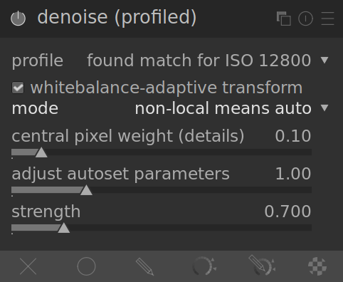

This module offers an easy to use and – at the same time – highly efficient denoise operation. Under the hood it applies (your choice of) a _non-local means_ or _edge-aware wavelet_ denoise algorithm with parameters specifically profiled for certain camera models and ISO settings.

One issue with a lot of denoising algorithms is that they assume the degree of variance in the noise is independent of the luminosity of the signal. By profiling the noise characteristics of a camera's sensor at different ISO settings, the level of variance at different luminosities can be evened out, and then the denoising algorithm can more evenly smooth out the noise.

At the current time darktable has sensor noise profiles for over 300 popular camera models from all the major manufacturers. If you generate your own noise profile for a camera not yet supported in darktable's noise profile database, be sure to share it with the darktable development team so they can include it in the next release!

# modes

The _denoise (profiled)_ module implements two main algorithms

non-local means (auto)
: this algorithm works in the spatial domain, and provides a simplified user interface to make denoising as convenient as possible. Note that this algorithm is quite processor-intensive. 

non-local means
: this mode unlocks the full set of sliders for the non-local means algorithm to provide maximum flexibility in managing noise in your image,

edge-aware wavlets (auto)
: this works in the [_wavelet_](../../darkroom/interacting-with-modules/wavelets.md) domain, and provfides a simplified user interface, especially when used in conjunction with the _Y0U0V0_ interface. The wavelet decomposition allows you to adjust the strength of the denoising based on the coarseness of the noise in the image. The wavelet modes are less processor-intensive than the _non-local means_ algorithm.

edge-aware wavlets
: this unlocks additional sliders to provide more flexibility. It can also be used with the _Y0U0V0_ interface, or you can fall back to the more complicated RGB interface in either of the wavelet modes.

## luma versus chroma noise

Both “non-local means” and “wavelet” can tackle efficiently luma (lightness) noise and chroma (color) noise.  

In the past with darktable, it was suggested to use two instances of the denoise (profiled) module. The first instance would be used together with a color blending mode in order to tackle _chroma_ noise (ie. getting false colours due to noise), and the second instance after that would be used to tackle _luma_ noise (ie. where the noise produces a "graininess" due to variations in brightness). This isn't really recommended anymore, since _denoise (profiled)_ module occurs early in the pixel pipe, before the input color profile, in order that the profile parameters are accurate, but color blending modes should really come after the input color profile is applied.

The new improved _denoise (profiled)_ algorithms now each provide their own methods of dealing separately with luma and chroma noise, and in both cases this can be handled within a single module instance.

# module controls

The _denoise (profiled)_ module provides a few controls that are independent of the algorithm used. These are described first, before moving on to the algorithm-specific controls. When describing the controls specific to an algorithm, we will first cover the simplified interface, and then move on to the more advanced controls for that algorithm.

Note that sliders will have minimum and maximum values by default. However, these are soft limits, and where needed a higher value can be entered for slider using a `right click` on the slider and entering a higher value via the keyboard.

## common controls

profile
: Based on Exif data of your raw file, darktable will automatically determine the camera
model and ISO setting. If found in its database, the corresponding noise profile will
be used. If your image has an intermediate ISO value, the statistical properties will be
interpolated between the two closest datasets in the database, and this interpolated
setting will show up as the first line in the combo box. You also have the option to manually
overwrite this selection to suit your personal preferences better. The top-most entry in
the combo box brings you back to the profile darktable deems most suited.

mode
: the mode option sleect which algorithm to use for the denoising, and whether to present the simplified or full manual interface for that algorithm.

whitebalance-adaptive transform
: As white-balance amplifies the RGB channels differently, they exhibit different noise levels. This checkbox makes the algorithm adaptive to white balance. This option should be disabled on the second instance if you have used a first instance with a color blend mode.

strength
: This parameter is here to fine-tune the strength of the denoise effect. The default value has been chosen to maximize the peak signal to noise ratio. It's mostly a matter of taste if you prefer a rather low noise level at the costs of a higher loss of detail, or if you accept more remaining noise in order to have finer structures better preserved within your image.

: In the case of _wavelets_ mode, the default value of this slider may not be enough. If you do not set enough strength on this slider, then adjusting the wavelet curves above it will not have a big enough effect. It is therefore recommended to set a reasonably high strength on this slider, and than make finer adjustments on the wavelet curves. Don't hesitate to `right-click` and enter a higher value for this slider if the default soft limit for this slider doesn't allow for enough denoising. 

adjust autoset parameters
: this slider automatically controls adjusts all the other parameters on the denoising algorithm. It is particularly useful when you have had to push up the exposure on an under-exposed image. This will normally introduce noise into the image, in a similar way as if you had taken the shot with a higher ISO setting. This control compensates for that and uses settings similar to what it would use for an image actually taken at a higher ISO setting. In general, the value of this slider indicates how many stops you had to push the exposure. For example, if you had to push the exposure 2 stops above what you normally use, then set this slider to `2`.

## non-local means auto sliders

central pixel weight
: This slider controls the amount of detail which should be preserved by the denoising. By default, it will have a low value, meaning that the algorithm will treat both luma and chroma noise. Moving this slider to the right will reduce the amount of luma denoising, so that the denoising will primarily affect chroma noise. By adjusting this slider together with the _strength_ slider, you can find a good balance in the amount of luma versus chroma denoising.

## non-local means advanced sliders

When you take non-local means out of auto mode, the _adjust autoset parameters_ slider will be replaced by the following controls. You can use the auto-adjust slider to arrive at some initial settings, then when you switch to manual mode, the sliders will show the set of manual settings that are equivalent to that auto-adjust setting. You can then continue to fine-tune the manual settings using the initial auto setting as a basis.

central pixel weight
: this slider works just the same as it does in _non-local means (auto)_ mode.

patch size
: This slider controls the size of the patches being matched when deciding which pixels should be used to calculate an average. Set this to higher values as the noise gets higher. Be aware that high values may smooth out small edges. The effect of this slider on processing time is minimal.

search radius
: This slider controls how far away from a pixel the algorithm will try to find similar patches. Increasing the value can give better results for very noisy images when coarse grain noise is visible, but the processing time is ghugely impacted by this parameter (the processing time is in the order of the square of this parameter). A lower value will make execution faster, a higher value will make it slower. It most cases it is better to use the scattering parameter, which has a similar effect but without the heavy processing cost.

scattering
: Like the _search radius_, this slider controls how far from a pixel the algorithm will try to find similar patches. However, it does this without increasing the number of patches considered. As such, processing time will stay about the same. Increasing the value will reduce coarse grain noise, but may smooth local contrast. This slider is particularly effective in reducing chroma noise.

## wavelet curves

These curves are only available if mode “wavelet” is selected. The noise of an image usually consists of both fine grain and coarse grain noise, to varying degrees. These curves allow the strength of the denoising to be adjusted depending on the coarseness of the visible noise. The left end of the curve will act on very coarse grain noise, while the right of the curve will act on very fine grain noise. Pushing up the curve will increase the amount of smoothing, whereas pulling it down will decrease the amount of smoothing.

For example, you can preserve very-fine grain noise by pulling down the right-most part of the curve down towards the bottom. If you were tackling chroma noise (eg. on a U0V0 curve, or on a second module instance with a color blend mode) you could push the right side of the curve up towards the top, since colors are not supposed to change a lot on fine grain scales. This can be useful if you see some noisy isolated pixels with the wrong colour.

## wavelets _Y0U0V0_ interface

The preferred way to use wavelets is with the new _Y0U0V0_ mode. This breaks the denoising of the pixels up into luminance (_Y0_) and color (_U0V0_) components. You can then use the _Y0_ curve to control the level of luma denoising at different scales, and you can use the _U0V0_ curve to control the level of chroma denoising at different scales.

## wavelets RGB interface

Before the _Y0U0V0_ interface, wavelet-based denoising was done directly on the _R_, _G_ and _B_ channels, either all together in one go, or on an individual channel basis.

In case you want to denoise the channels separately, the best way is to use an instance of the [_channel-mixer_](channel-mixer.md) module just before before the _denoise (profiled)_ module so that is outputs a grey channel based 100% on the _red_ channel only, then denoise the monochrome image using the _red_ wavelet curve. Repeat this procedure for the blue and green channels repsectively. This procedure is time-consuming, but gives the best result because looking at the color of a noisy pixel is not a reliable way to determine which channel to adjust (eg. a noisy red pixel could be due to a noise peak on the red channel, but cause also be due to a noise lull on the blue and green channels).

The issue with denoising the _RGB_ channels individually like this is that there can still be some residual chroma noise at the end that requires excessive smoothing to eliminate. This was in fact one of the key motivations behind implementing the _Y0U0V0_ interface.

### wavelets advanced sliders

When you take _wavelets_ out of _auto_ mode, the _adjust autoset parameters_ slider will be replaced by the following controls.

preserve shadows
: This option is available in “wavelets” and “non local means” modes. It allows to denoise
more agressively the shadows or the highlights. Lower the value to denoise more the
shadows than the highlights. Usually, as noise increases, you will need to lower this value.

bias correction
: This option is available in “wavelets” and “non local means” modes. It allows to correct the
color cast that may appear in the shadows. Increase this value if dark shadows appear too
greenish, decrease it if they appear purple-ish.

