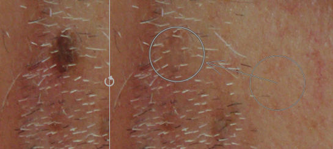
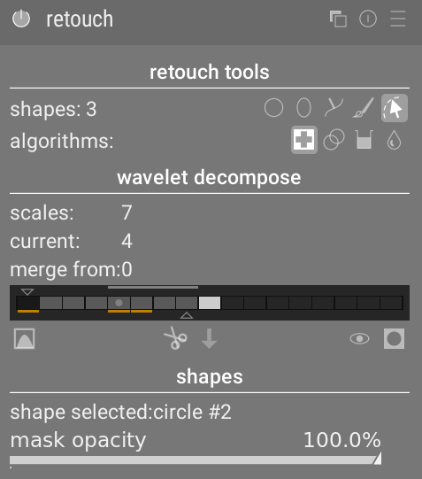

The _retouch_ module is a newer more advanced alternative to the [_spot removal_}(spot-removal.md) module. It goes beyond the simple cloning capability of _spot removal_, and includes a "heal" tool based on the "heal" tool from GIMP, which provides a type of seamless cloning. It also takes advantage of [wavelets](../../darkroom/interacting-with-modules/wavelets.md) to allow an image decomposed into layers of varying detail. The layers can then be selectively retouched before being put back together to make a final image. Examples of these capabilities are shown in the coming sections.

# seamless cloning

Cloning is where we want to hide part of an image by taking another part if the image and using it to "paint over" the bit we want to hide. An example might be that we want to get rid of a small cloud in a blue sky:

We take a piece of blue sky next to the cloud, and paint over the cloud we want to hide using the _basic cloning_ tool ():

]

However, if the sample we take doesn't match exactly the surroundings of the item we want to clone out, the result can look a bit jarring. In our example, the sample of sky we chose to use was slightly darker that the piece of sky where the cloud is located:

If we instead use the _heal_ tool (), the color and luma of the sample is blended in to fit in better with the surroundings. In our example, we get a nice uniform sky:

# fill and blur

The _clone_ and _heal_ tools both require us to specify another part of the image which will be used to "fill in" the region we want to hide. Sometimes there is no suitable sample in the image that we can use to fill over the spot. In such cases, the _retouch_ module offers a couple of options:

fill tool ()
: This tool will fill in the selecgted region using a particular color.

blur tool ()
: This tool blurs over the selected region, smoothing over any detail.

These two options are most useful when used together with wavelets, where they can be used to smooth over something within a selected scale-of-detail layer.

# managing strokes

When we activate the _clone_ or _heal_ tool, we place on the image one or more "storkes", where a stroke consists of a target region to be repaired, and a source region from which to obtain the sample used to paint over the target region. Once we have selected the shape we want to use to identify a region, the placing of the stroke can be done in several ways:

- simply `Click` on the image, which will place the target region in that spot. The source region will be placed in an arbitrary location, and can be adjusted later.

- `Drag` from the point where you want the target region to go, and release the mouse when you reach the place where the source region should be placed.

- While you `Mouse-over` the image, you will see a special cursor marking out shape of the target region, and showing a small plus sign (`+`) where the source region will be placed:
  
  Use `Shift-click` to place the source region "plus" (`+`) symbol under the mouse pointer. Then move the mouse and `Click` to place the target region. If you place multiple strokes with subsequent `Click` operations, each time the source region will be placed at the same offset from the target region as was used for the first stroke.

- Similar to the previous method, use `Ctrl-click` to place the source region "plus" (`+`) symbol, then choose the target region. Any placement of subsequent target region will use exactly the same source region, fixed in the absolute coordinate system of the image.

# retouch with wavelets

Wavelets allow us to decompose an image into different layers with vary levels of detail, so that we can work on the layers separately and then recombine that at the end. This is particularly useful in portrait photography, where we are able to deal with skin blotches and blemishes on a coarse layer of detail, while leaving the skin texture in a finer layer of detail untouched. The [_wavelets_](../../darkroom/interacting-with-modules/wavelets.md) section provides an example of how wavelets decompose the image into layers with different levels of detail.

Through this method, we could for example use the healing tool to paint over a spot that appears in one of the coarse detail layers, while leaving the whiskers in the fine detail layers intact:

# module controls

The module controls are show in the following diagram:

The following sections go thorugh the different sections of the module one by one.

## retouch tools

The _retouch tools_ section consists of two items:

shapes
: The number after the _shapes_ label indicates how many shapes have been placed in the image, either directly or inside a wavelet layer. You can define a region using _circle_ () tool, _ellipse_ () tool, _path_ ( tool (use `Ctrl+click` to define multiple segments of a path that will outline the region to be retouched) or _brush_ () tool (can specify the region using brushstrokes, use `Ctrl+click` to use multiple bruskstrokes). Use the _shapes_ () tool to toggle whether the outlines of the existing shapes are overlayed on the image.

algorithms
: This allows a retouching algorithm to be selected, which could be one of: (basic) cloning (), healing (), fill () or blur ().

## wavelet decompose

The _wavelets decompose_ section centres around a bar graph showing how the image has been decomposed into layer of different scales of detail. The key features of the bar graph are:

- The black square on the left end represents the entire non-decomposed image
- The grey squares show the various wavelet layers, with most detailed a the left, and coarsest at the right.
- The white square on the right end represents the residual detail layer.
- A light grey dot in a square indicates that this layer is currently selected.
- The light grey bar runnign along the top indicates which levels of detail are able to be observed at the current zoom level. Zoom in close to be able to see the finer levels of detail.
- The triangle at the top shows for which layers retouching edits should be included in the output image. Moving the triangle to the right allows you to exclude edits to some of the finer detail layers.
- The triangle at the bottom shows how many layers the image should be decomposed into. `Drag` the triangle to the right to create more layers.
- The orange highlists under the squares indicate which layers have retouching edits applied.

The remaining items in this ection are:

scales
: Indicates how many wavelet layers the image is being decomposed into

current
: Indicates which layer is currently selected (also marked with the light grey dit on the bar graph)

merge from
: Indicates from which starting layer retouching edits should be included. A `0` indicates that all edits from all layers should be included, including any applied directly to the un-decomposed image.

display wavelet scale ()
: Toggles whether to display the current selected wavelet layer, or the un-decomposed image.

cut ()
: Put the selected shapes on the current layer onto the clipboard so they can be moved to another layer

paste ()
: Move the shapes on the clipboard from their existing layer over to the currently selected layer.

disable shapes ()
: Toggle whether the edits associated with shapes should be actively shown or not.

mask ()
: Toggle whether or not the current masks should be highlighted with a yellow overlay.

## shapes

This section shows the settings related to the currently selected shape. The parameters are:

shape selected
: Indicates which shape is currently selected, and what type of shape it is.

mask opacity
: This slider allows you to vary the opacity of the mask associated with the selected shape. an opacity of `1.000` indicates the effect of the shape is completely opaque, whereas a value less than `1.000` indicates that the effect applied by the shape is blended with the underlying image to the degree indicated by the slider.

