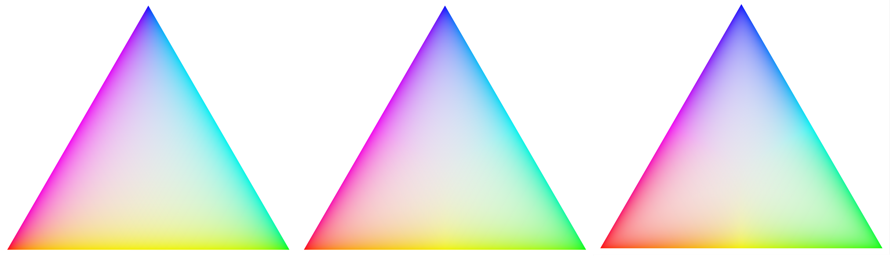

Easy to use and robust display transform.

The sigmoid module uses a modified generalized log-logistic curve to smoothly compress the infinite scene referred space into a displayable finite space.

---

**Note**: Modules placed before the sigmoid module works in scene-referred space. Modules after sigmoid work on the formed image of the scene, aka display-referred space.

---

# usage
only use one display transform
: Never use sigmoid together with filmic rgb or base curve. Pick one.

adjust for the mid-tones
: The sigmoid curve pivots around middle grey. Begin your editing by adjusting your exposure before adjusting the sigmoid module's parameters.

less is more
: It is commonly better to adjust your image in other modules than in the display transform. Make color adjustments in color balance rgb, compress highlights and lift shadows in the tone equalizer or with a masked exposure, etc.

preserve hue to taste
: There are multiple definitions of how hue should be preserved. Recommended to use the per channel mode and to tune in your preferred amount of hue preservation on a per-image basis. Sunsets and fire are two examples where users commonly reduce the hue preservation amount to gain a "hotter" look.

# module controls

contrast
: Adjust the compression aggressiveness.
: 
: 
: 
: Example exponential gradients with low, medium, and high contrast. Notice that middle grey is unchanged.

skew
: Lean the compression towards shadows or highlights.
: 
: 
: 
: Example exponential gradients with negative, neutral, and positive skew. Notice that middle grey is unchanged.

color processing
: Mode used for mapping pixel values from scene to display space.
: The _per channel_ mode applies the sigmoid curve on each rgb channel separately, affecting pixel luminance, chroma, and hue color aspects. Hue can be optionally preserved to a selectable degree; see preserve hue. This mode is what most other image editing softwares are using, is in line with the behavior of the color layers in analog film, and handles smooth roll-off to bright areas very well.
: The _rgb ratio_ is similar to _preserve color_ in filmic rgb. It maps the rgb triplet uniformly using the sigmoid curve, which preserves the spectral color of the pixel. Bright colorful pixels are desaturated along spectral lines as they would otherwise end up outside the display gamut.

preserve hue (per channel only)
: 0% - vanilla per channel with heavy hue skewing. 100% - preserve the spectral hue of the image, same hue definition as when using rgb ratio. An ok approximation of preserved perceptual hue is usually somewhere between the two extremes.
: 
: Per channel color processing mode, preserve hue; 0%, 50%, and 100%.

target black
: Lower bound that the sigmoid curve converges to as the scene value approaches zero, usually kept as is. Possible to use for a faded analog look. It is, however, preferred to use the color balance rgb global offset for the same effect.

target white
: Upper bound that the sigmoid curve converges to as the scene value approaches infinity, usually kept as is. It can be used to clip white at some scene intensity for cases when that is desired.
