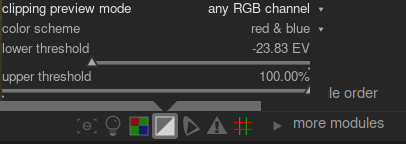

When we send an image to a display device, we normally represent each color pixels as a set of 3 numbers, representing the intensity of the red, green and blue primary colors in the output color space that, when we mix them togather, produce the appropriate color of that pixel. Because the output color space is normally closely related to play ardware with physical limations, the output color space will have a maximum value allowed for the [R,G,B] channels representing maximum intensity, and there will also be a minimum value below which anything gets mapped to zero. When we try to convert from a larger color space to the final output color space, any values exceeding the maximum allowed value will need to be clamps to that maximum value, and any values below the minimum will need to be clamped to zero. This process is called "clipping", and we will lose detail and/or get wrong colours for any pixel where this occurs.

There are two reasons why a pixel might become clipped when representing it in the final output color space.

- _luminance_ clipping can happen when a pixel is too bright to be represented in the output color space. The pixel luminance is calculated as a weighted average of the [R,G,B] channels, and if this average exceeds the maximum allowed value, it is an indication of over-exposure. The overall luminance of a pixel can also be too dark to be represented by an [R,G,B] in the output color space, in which case it will simply be shown as black. We normally deal with luminance clipping by carefully adjusting our tone mappings and exposure levels.

- _gamut_ clipping. The output color space defines some primary colors that mixed together in certain amounts to produce the final output color. However, there are only so many colors that can be produced by mixing together a combination of those three primary colours. Highly saturated colors in particular can be a problem to represent, especially for pixels that are very bright or very dark. If there is no set of positive [R,G,B] values that can represent this color at this level of brightness, we say the color is "out of gamut", and we'll need to settle for another color instsead which _can_ be represented by [R,G,B] values that fall within the minimum and maximum limits of the color space. We can deal with gamut clipping by being careful not to over-saturate colours in the highlights and shadows, and possibly using some color grading/color mapping techniques.

The darkroom provides a "clipping warning" module to help us see when pixels can't be accurately represented in the output color space, either due to luminance or gamut clipping. Prior to darktable 3.4, the clipping indicator would highlight for you any pixels that exceeded the maximum allowed value on any of the [R,G,B] channels, or that had been completely crushed to black. From darktable 3.4 onwards, the clipping warning indicator has more modes available that help you to differentiate between luminance clipping versus gamut clipping, so that you can make better decisions how to address it using tone mapping and/or color grading strategies.

There are a couple of other tools relating to clipping in darktable which should not be confused with the clipping warning indicator that is the subject of this section, which deals with clipping caused by our processing steps and limitations in our output color space.

- the [raw overexposed](raw-overexposed.md) module, which indicates where pixels in the original raw file are clipped to physical limitations in the dynamic range of the camera sensor itself. Here, inforamtion was permanently lost at calture time, and you need to deal with it the best you can using highlight recovery techniques.

- The [gamut check](gamut-check.md) indicator also provides information about clipping arising from our processing, based on the external littleCMS library, and is more or less equivalent to the _full gamut_ mode in the clipping warning. The downsides ofthe gamut check indicator are that it doesn't allow you to distinguish between clipping caused my luminance or gamut mapping, and it is much slower than the clipping warning indicator because it uses the external littleCMS library and doesn't support OpenCL GPU acceleration.

# module controls

clipping preview mode
: This allows you to set which type of clipping you want the indicator to highlight, and can be one of the following modes.

- _any RGB channel_ mode, which provides an over-clipping indication if any one of the three _RGB_ channels exceeds the maximum allowed value for the output color space, or an under-clipping indication if the three [R,G,B] channels are too dark and are all forced to black. This was the default mode in darktable versions prior to 3.4.
- _luminance only_ mode, which shows the clipping due to the luminance of a pixel exceeding the upper threshold defined below. If this happens, it generally means the tone mapping or exposure settings have been poorly set
- _saturation only_ mode, which shows where over-saturated colors have pushed one or more of the [R,G,B] channels towards taking on a value outside the permitted range of the output color space, even though the overall luminance of the pixel may lie within the limits of the output color space. This means this pixel color is imposible to represent in the target color space, and can arise from poorly set gamut mapping or saturation settings,
- _full gamut_ mode, that shows the combination of the 3 previous options. This is the default mode from darktable 3.4 onwards, and it give the most complete picture where there are problem areas.

color scheme
: By default, the indicator marks with _red_ pixels where the upper threshold is exceeded (over-clipping), or marks with _blue_ areas where the lower threshold is breached (under-clipping). This color scheme can be changed to _black & white_ or _purple & green_ for "over & under" indicators, which may be useful to improve visibility if the indicators for some images.

lower threshold
: Expressed in EV relative to the white point (which is nominally EV = 0). If the [R,G,B] channels all fall below this value, an under-clipping indicator is shown warning that the pixel may be end up being crushed to black. For your reference in setting this threshold:

- _8-bit sRGB_ clips blacks at -12.69 EV
- _8-bit Adobe RGB_ clips blacks at -19.79 EV
- _16-bit sRGB_ clips blacks at -20.69 EV
- _fine-art matte prints_ typically produce black at -5.30 EV
- _color glossy prints_ typically produce black at -8.00 EV
- _black-and-white glossy prints_ typically produce black at -9.00 EV

upper threshold
: Expressed as a percentage of how close a pixel should be to the upper limit before being flagged by the clipping warning. Defaults to 98%. In the case of gamut checks, it indicates how close the saturation of the pixel is allowed to get to the limits of the color space gamut before a clipping indication is flagged.

