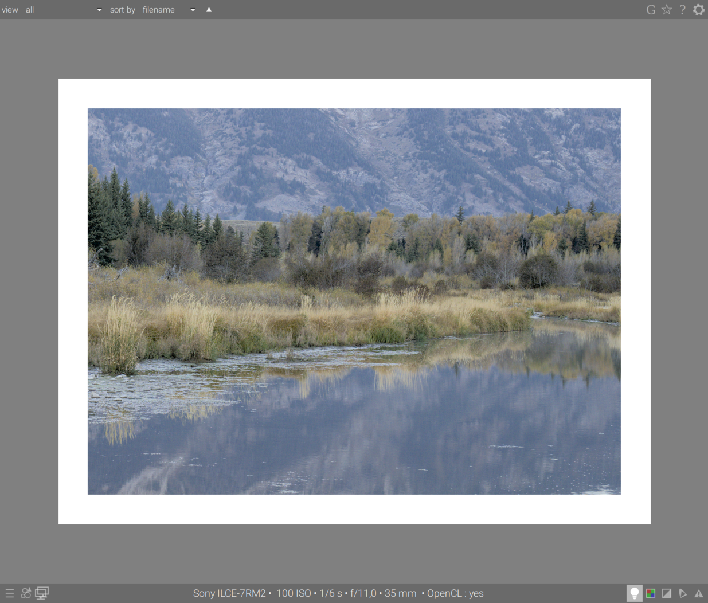

When developing a photo, the way we perceive brightness, contrast and saturation is influenced by the surrounding ambient condiations. If an image is displayed against a dark background, like what we have for the default theme in darktable, it can have the following effects on our perception of that image:

- exaggeration of the exposure perceived in the image, making the image seems brighter than it really is. This is nicely illustrated by the [Adelson checkerboard shadow effect](https://en.wikipedia.org/wiki/Checker_shadow_illusion).
- decrease in the perceived saturation in the image, making the colors seem less rich than they really are (the Hunt effect).
- decrease in perceived contrast in the image, making the tones seem flatter than they really are (Bartleson-Breneman effect 3)

The end result is that the image can end up being too dark, and overly-processed in terms of contrast and color saturation. To avoid this, the ISO 12646:2008 standard makes some recommendations about the conditions under which the colors of an image should be assessed. The _color assessment_ module in darkroom places a frame around the image to help the user better assess the colors in the image, along the lines of those recommendations.

When the lightbulb icon () under the image is selected, the image is zoomed out so that a thich mid-grey border appears around the image to act as a reference against which to compare the tones in the image. A thinner white border is placed immediately around the image to give the eyes a basis for comparison when looking at parts of the image that are meant to be a bright white.

Although the color assessment mode provides a mid-grey surrounding around the image, it is recommended to set your user interface to the "darktable-elegent-grey" theme. This is designed to be close to middle grey (it is slightly darker to allow better contrast with the text in the user interface), and when this theme is used together with the color assessment mode, it will help to avoid the problems mentioned previously.

# module controls

lightbulb icon ()
: enable color assessment conditions along the lines of those recommended in ISO 12646:2008

