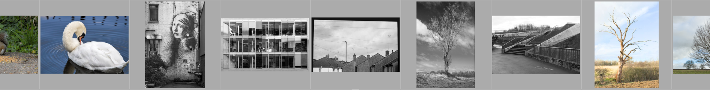

The filmstrip can be used to quickly switch between images in any darktable view. The images shown are the same as displayed in the lighttable view and are defined by the currently-selected collection.



The filmstrip can be switched on and off using the shortcut Ctrl+F. The height of the filmstrip panel can be changed by clicking and dragging its top border.

Quickly navigate through the images in the filmstrip by scrolling with the mouse. In the darkroom you can change the photo currently being processed by clicking on another image in the filmstrip.

In the darkroom, the image currently being processed is selected and highlighted. Use Mouse over to select any other image from the filmstrip (in order to act on it with a keyboard shortcut) without changing the image being processed.

If you wish to select multiple images in the filmstrip, use Alt+click to select the first image and then Ctrl+click to add to or remove images from the selection or Shift+click select a range of images.

The following shortcuts are available to select images in the filmstrip or to perform actions on the selected images:

```
Ctrl+A         select all images in the filmstrip
Ctrl+Shift+A   deselect all images
Ctrl+I         invert the current selection

F1 – F5        toggle color label (red, yellow, green, blue, purple)
0 – 5          set/change image rating
R              reject image
Ctrl+D         duplicate image
Ctrl+C         copy the full history stack
Ctrl+V         paste all of the copied history stack
Alt+Ctrl+C     selectively copy the history stack
Alt+Ctrl+V     selectively paste from the copied history stack
```

See the lighttable's [history stack](../lighttable/history-stack.md) documentation for more details of the copy and paste functionality.
