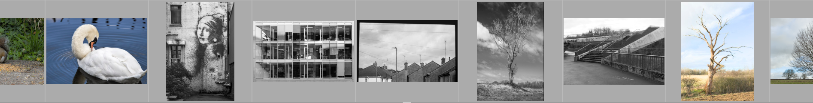

The filmstrip can be used to quickly switch between images. The images shown are the same as those displayed in the lighttable view and are defined by the currently-selected collection.

The filmstrip can be switched on and off using the shortcut Ctrl+F. The height of the filmstrip panel can be changed by clicking and dragging its top border.

Quickly navigate through images in the filmstrip by scrolling with the mouse. Increase scroll speed with Shift+scroll. Change the height of the filmstrip with Ctrl+scroll or by clicking+dragging the top of the panel. Change the [custom sort](./collection-filters.md#custom-sort) order of images by dragging and dropping image thumbnails.

In the darkroom, the image currently being processed is selected and highlighted. Double-click on an image to open it for editing. Single clicking a currently not-opened image will also select that image in addition to the currently open one. 

By hovering inactive images you can act on them with a keyboard shortcut without changing the image being processed. Placing the cursor over the main viewport in effect hovers the current image.

If you wish to select multiple images in the filmstrip, click to select the first image followed by either Ctrl+click to select or de-select further images, or Shift+click to select a range of images.

----

**Note**: The currently open image will be kept selected, even when selecting other images. This is different from the behaviour in lighttable view and from what you might be used to from your file explorer. It is something to be aware of to avoid e.g. accidentaly rejecting the currently open image. 

----

The following shortcuts can be used to select images in the filmstrip:

-   `Ctrl+A` selects all images in the filmstrip

-   `Ctrl+Shift+A` deselects all images

-   `Ctrl+I` inverts the current selection

The following shortcuts can be used to perform operations on the selected images

-   `F1, F2, F3, F4, F5` adds or removes a color label (red, yellow, green, blue, purple, respectively). A color label will be added if _any_ selected image does not currently have the label; otherwise the label will be removed

-   `0, 1, 2, 3, 4, 5` sets the star rating

-   `R` rejects the image(s)

-   `Ctrl+D` duplicates the image(s)

-   `Ctrl+C` copies the full history stack

-   `Ctrl+V` pastes all of the copied history stack

-   `Ctrl+X` copies the settings of the of the last changed module to all selected images

-   `Ctrl+Shift+C` selectively copies the history stack

-   `Ctrl+Shift+V` selectively pastes from the copied history stack

See the lighttable's [history stack](../lighttable/history-stack.md) module documentation for more information about the copy and paste functionality.

The filmstrip image under the cursor can be pinned to the [second darkroom window](../../../darkroom/darkroom-view-layout/#bottom-panel) by assigning a shortcut to [utility modules > filmstrip > pin in second window](../../../preferences-settings/shortcuts.md).
