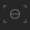
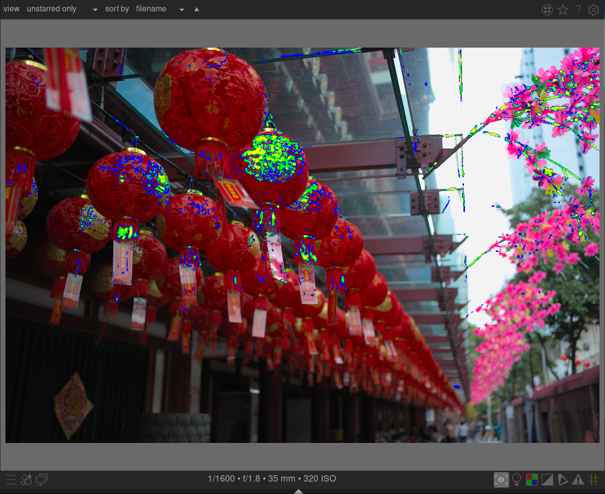

The _focus peaking_ module allows you to analyse an image and identify which parts of the image are sharp and in-focus. It works in the lighttable view, where you can easily see at a glance which images are sharp and which are blurry, and it also works at the darkroom view, when you are processing one specific image.

The module is activated by clicking on the focus-peaking icon (. It will then mark up the sharp parts of the image with yellow, green and blue colors:

The module works by pre-filtering out noise, then measures the gradients of intensity in the image and calculates average and standard deviation statistics. When the gradient of an edge differs significantly from the mean, the associated pixels are marked up with a color "heat map" indicating how sharp the edge is.

- _yellow_ indicates a big (6σ) jump in gradient, which indicates a very sharp edge.
- _green_ indicates a medium (4σ) jump in gradient, which indicates a reasonably sharp edge.
- _blue_ indicates a small (2σ) jump in gradient, which indicates a slightly sharp edge.

The sample image above was taken with a wide aperture to give a shallow depth of field, and you can see how the camera has focused on the chinese character written on the second red lantern along from the front. There are also stems of the pink flowers which fall within the area of acceptable sharpness around the focal plane, and they have also been marked up with yellow and green.

# module control

focus peaking icon ()
: enable the focus peaking analysis and highlighting on a darkroom image or on the lighttable thumbnails.

