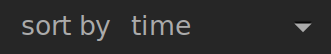

The top panel is common to all darktable views and provides a number of common utility functions.

# On the left-hand-side

view

: Choose which images to view in the lighttable/filmstrip, based on star rating and reject status.

sort by

: Choose the property to sort by from the dropdown.

sort order

: Switch the sort order (ascending / descending) with the arrow-toggle.

# On the right-hand-side (icons)

grouping

: Expand or collapse grouped images

thumbnail overlays

: Define what information is displayed over thumbnails in the lighttable/filmstrip.
: You can define different settings depending on the thumbnail size (set sizes categories in [`preferences > lighttable`](../../preferences-settings/lighttable.md))

context-sensitive help

: Click on this icon and then click on a control element to be directed to the appropriate online help page.

preferences

: Open the [preferences & settings](../../preferences-settings/_index.md) dialog
