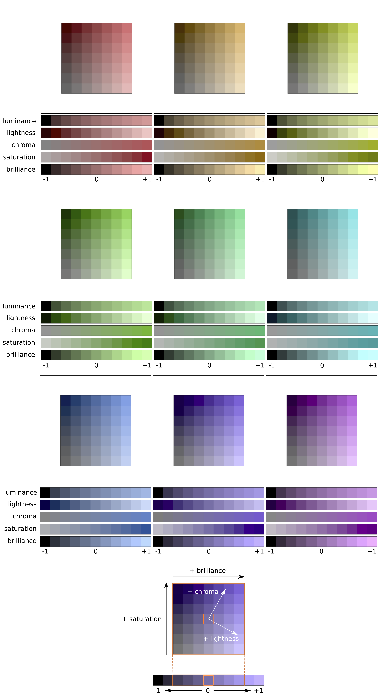
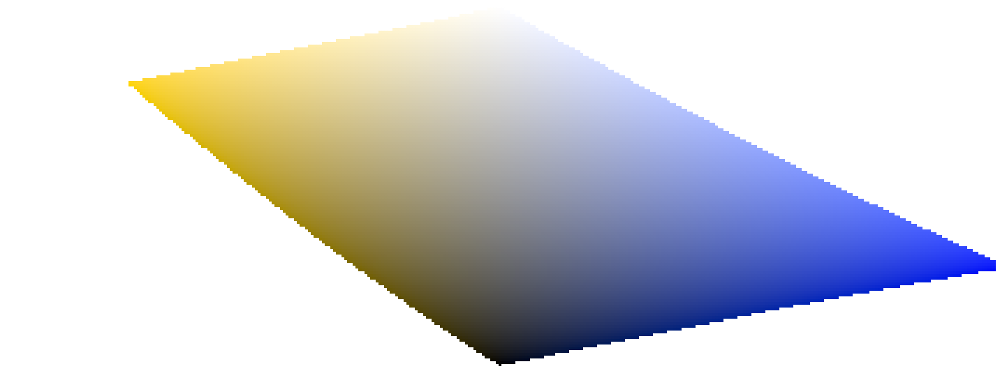
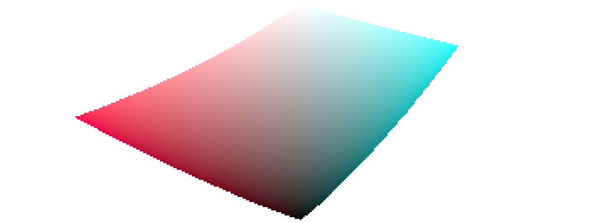
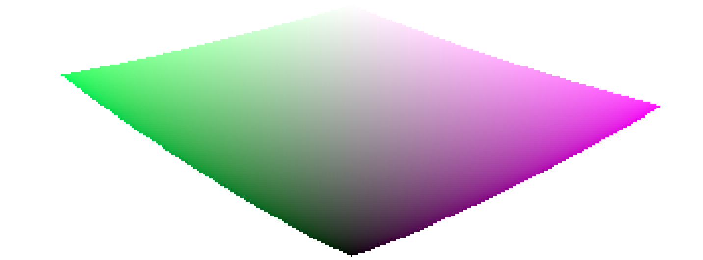

This section defines the perceptual properties of color, both conceptually and quantitatively, in order to characterize and quantify the creative and corrective adjustments made to color in darktable.

# definitions

Color properties like "saturation", "brightness" or "lightness" have passed into common usage but are largely misused and often used to mean different things. In color science, each of these terms has a precise meaning.

There are two frameworks within which color properties may be analyzed and described:

- A scene-linear, physiological, framework, that mostly focuses on the response of the retina cone cells, using color spaces such as CIE XYZ 1931 or CIE LMS 2006,
- A perceptual, psychological, framework that stacks the brain's corrections on top of the retina signal, using color spaces such as CIE Lab 1976, CIE Luv 1976, CIE CAM 2016 and JzAzBz (2017).

These two frameworks provide us with metrics and dimensions to analyze color and allow us to change some of its properties while preserving others. 

The following dimensions of color are used by darktable:

hue
: An attribute of visual perception in which an area appears to be similar to one of the colors red, yellow, green, or blue, or to a combination of adjacent pairs of these colors considered in a closed ring. [^1] Hue is a shared property between the perceptual and scene-linear frameworks.

luminance
: The density of luminous intensity with respect to a projected area in a specified direction at a specified point on a real or imaginary surface. [^2] Luminance is a property of scene-referred frameworks, and is expressed by the Y channel of the CIE XYZ 1931 space.

brightness
: An attribute of visual perception according to which an area appears to emit, transmit or reflect more or less light. [^4]

lightness
: The brightness of an area judged relative to the brightness of a similarly illuminated area that appears to be white or highly transmitting. [^3] Lightness is the perceptual, non-linear homologue of luminance (roughly equal to the cubic root of luminance Y). Lightness is expressed by the L channel in CIE Lab and Luv 1976 and the J channel in JzAzBz.

chroma
: The colorfulness of an area judged as a proportion of the brightness of a similarly illuminated area that appears gray, white or highly transmitting. [^5] _Warning: chroma is not short for chrominance, which is the color part of a video signal (the Cb and Cr channels in YCbCr, for example)._

brilliance
: The brightness of an area judged relative to the brightness of its surroundings. [^6]

saturation
: The colorfulness of an area judged in proportion to its brightness. [^7]

[^1]: CIE definition of _hue_: <https://cie.co.at/eilvterm/17-22-067>
[^2]: CIE definition of _luminance_: <https://cie.co.at/eilvterm/17-21-050>
[^3]: CIE definition of _brightness_: <https://cie.co.at/eilvterm/17-22-063>
[^4]: CIE definition of _lightness_: <https://cie.co.at/eilvterm/17-22-059>
[^5]: CIE definition of _chroma_: <https://cie.co.at/eilvterm/17-22-074>
[^6]: Article about _brilliance_ (paywall): <https://doi.org/10.1002/col.20128>
[^7]: CIE definition of _saturation_: <https://cie.co.at/eilvterm/17-22-073>

Colors can be described in many different color spaces, but no matter the color space, each color needs at least 3 components: some metric of luminance or brightness, and 2 metrics of chromaticity (hue and chroma, or opponent color coordinates).

# illustrations

While the previous definitions are useful to give a meaning to the words, they don't tell us what we should be looking at. The following charts show luminance, lightness, chroma, brilliance/brightness and saturation varying from a "0" base color and how the resulting colors degrade:

(Lightness + Chroma) or (Brilliance/Brightness + Saturation) are two different ways to encode the same reality. They are orthogonal spaces that can be converted from one to another by a simple rotation of the base. This means that chroma evolves at constant lightness, saturation evolves at constant brilliance/brightness, and vice versa:

Lines of equal chroma are vertical (following the patches grid), meaning that chroma has the same direction for all colors in the gamut (see below). However, lines of equal saturation are oblique (drawn dashed on the graph) and all go from black though each color patch, meaning that their directions are particular to each color.

Increasing the chroma will therefore move all colors uniformly away from the central gray axis horizontally, while increasing the saturation will close or open the angle of the oblique dashed lines like a flower.

Similarly, increasing the lightness will move all colors uniformly up from the horizontal axis, while increasing brilliance/brightness will move them along the lines of equal saturation.

On both of the above charts, lightness, chroma, saturation and brilliance are drawn in the JzAzBz color space, which is a perceptual color space suited for an HDR signal, and is used in parametric masks and the color balance RGB module. Luminance is drawn in the CIE XYZ 1931 color space, and represents the effect of an exposure compensation. It shows the same behaviour as brilliance, except that the step size is not perceptually scaled.

---

**Note**: In this section, _brilliance_ and _brightness_ are both used to describe the same dimension. In all rigor, brightness is an absolute metric, whereas brilliance is the brightness of some surface relative to the brightness of its surroundings (that is, how much a surface "pops" out of its surroundings and looks fluorescent). But in image editing, increasing the brightness of some surface will indeed increase its brilliance too, so the term _brilliance_ is preferred in darktable's user interface for clarity and in reference to its visual effect.

---

# color dimensions and gamut

The gamut is the volume of colors that a certain color space can encompass and encode. It is important to note that, once converted to perceptual spaces, the gamut of any RGB space is not uniform along hues.

The following examples show the gamut volume of the sRGB space on hue slices containing the primary red, green and blue lights of the sRGB space, over a lightness-chroma plane with a uniform scale:

This shows that increasing the chroma (displacement over the horizontal axis) of some quantity can be safe for some hues at some lightness, but can push other hue-lightness coordinates way out of gamut. For example, we have much more margin in green or magenta than in cyan.

Many gamut issues at export are actually user-induced and the result of harsh chroma enlarging. For that reason, using brightness-saturation color models may be safer.

# color dimensions and complementary colors

Cyan, magenta, yellow (CMY) are complementary colors of red, green, blue (RGB). However, the complementary CMY spaces computed from RGB spaces are not perceptually complementary. To show this, we create a CMY space from sRGB, where cyan has sRGB coordinates (0, 1, 1), magenta (1, 0, 1) and yellow (1, 1, 0), and display it in a lightness-chroma space:

By comparing with the hue slices of the primary colors in the previous section, it is easy to see not only that the gamuts don't have the same shapes, but that the colors do not match.

This is one more reason to avoid using HSL/HSV spaces (derived from RGB spaces) to perform color editing: since these RGB spaces are not perceptually uniform in the first place, the resulting HSV/HSL spaces are not uniform either. While RGB spaces have some merit based on their connection to physical light, any process involving hue should go directly to perceptual spaces.

# color dimensions and settings

Many applications, including darktable, call any settings that affect chroma "saturation" (for example, in color balance, "contrast/brightness/saturation"). This is a symptom of software trying to be accessible to non-professionals by using a common language. This is misleading, since saturation does exist and is quite different from chroma. In addition, many video specifications improperly call chroma "saturation". Whenever darktable reuses such specifications, it uses the incorrect term from the specification rather than the proper color dimension term.
